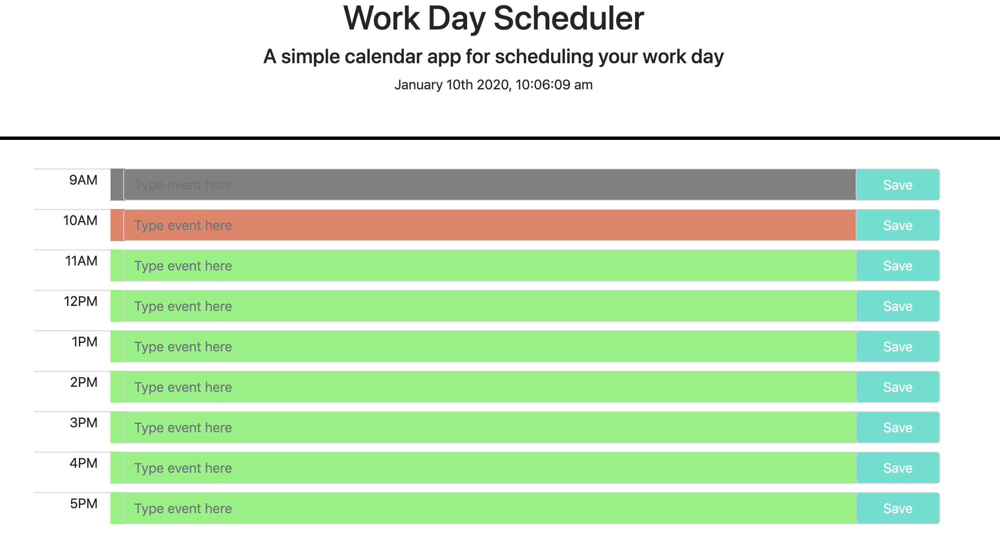

# Day Planner

This is a day planner to keep your day organized with important events. The current date and time is displayed at the top of the screen and you can plan your day from the hours of 9AM to 5PM. The planner is color coded, so when a time block is past, the hour block will turn gray. Current time shows in red and any future blocks will display green. Any event input is saved, so reloading the page will not effect your schedule. As someone with a busy schedule, it is critical to add important events to a daily planner so you can manage your time effectively. Enjoy!

